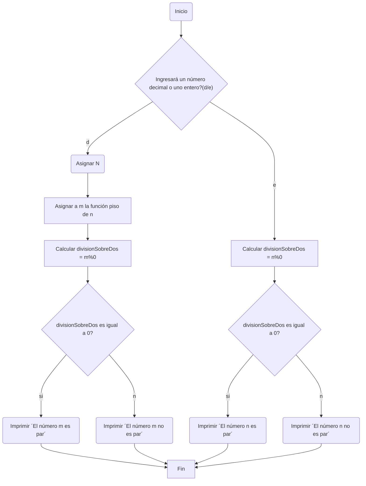

# Ingenieros Megatróficos 

***
# Taller 1
Desarrollo del taller 1 de la clase "programación de computadores"
## Integrantes del equipo: 
- Lucas Garcia Alvarez
- Kevin Daniel Castellanos Peña
- Julian Jacobo Gustin Moreno
***
## Lista de contenidos 
1.  [Python Beginner Quiz](#quiz) 
2.  [Mayor de 3 números](#mayordetres) 
3.  [Determinar si es par o impar](#paroimpar) 
4.  [Determinar si a es multiplo de b](#multiplos) 
5.  [Programa que lee tres números reales y determina si la suma de los dos primeros es mayor, menor o igual que el tercer número](#punto5) 
6.  [Vocal o consonante](#vocaloconsonante) 
7.  [Operaciones](#operaciones) 
8.  [Frecuencia de onda](#frecuencia) 
9.  [Capitales](#capitales) 
10. [Operaciones con distancias](#distancias) 
***
## Quiz

Se adjunta la captura del resultado del quiz

***
## MayorDeTres
[punto2](https://github.com/JulianGustin/Taller_1/blob/main/2.py) 
***
## ParOImpar
Para este programa, se usó el operador módulo (%) y con condicionales se determinaba si el número era par o impar (si el modulo es 0, es impar)  
Para números con decimales, se usó la función math incluida en python para la determinar la función piso del número ingresado por el usuario. 
### flowchart del ejercicio 

[PuntosImpares](https://github.com/JulianGustin/Taller_1/blob/main/Taller1-Notebook-Impares.ipynb)
***
## Multiplos 
### Flowchart
```mermaid
flowchart TD
    A[Inicio] -->B(2 reales)
    B-->C(A)-->E
    B-->D(B)-->E
    E[A/B]-->f
    f(¿el residuo es 0?)
    f-->|si|g(A es múltiplo de b)-->i
    f-->|no|h(A no es múltiplo de b)-->i
    i(Fin)
 ```
[punto4](https://github.com/JulianGustin/Taller_1/blob/main/4.py)
***
## Punto5
### Flowchart 
```mermaid
 graph TD;
    A(Inicio);
    A--> B[números x, y reales];
    B-->C[sum = x + y];
    C-->D["mostrar(¨la suma de tus números es:¨ sum)"];
    D-->E[número z real];
    E-->F{sum >= z ?};
    F-->|No|G[(¨mostrar el tercer número <br>es menor a la suma de los primeros¨)];
    F-->|Sí|H{sum = z ?};
    H-->|No|I["mostrar (¨el tercer número es mayor <br>que la suma de los primeros¨)"];
    H-->|Sí|J["mostrar (¨el tercer número es igual <br>a la suma de los primeros¨)"];
    J-->K(Fin);
    I-->K;
    G-->K;
```
[PuntosImpares](https://github.com/JulianGustin/Taller_1/blob/main/Taller1-Notebook-Impares.ipynb)
***
## VocaloConsonante
[punto6](https://github.com/JulianGustin/Taller_1/blob/main/6.py)
***
## Operaciones
Para este punto, y con base a 5 inputs del usuario, se pidió:  
- [El promedio](#promedio)
- [La mediana](#mediana)
- [El promedio multiplicativo](#PromedioMultiplicativo)
- [Ordenar los números de forma ascendente](#ascendente)
- [Ordenar los números de forma descendente](#descendente)
- [La potencia del mayor número elevado al menor número](#potencia)
- [La raíz cúbica del menor número](#raiz)
Se le pidió primero al usuario ingresar 5 números reales (tipo float) 
### Promedio
Para el promedio, simplemente se sumó los 5 inputs y se los dividió entre 5 
### Mediana
Para la mediana, se usaron una serie de condicionales, comparaciones y swaps para ordenar la lista de manera ascendente, y luego se imprimió el 3er número 
### Promediomultiplicativo 
Para este, se multiplicaron todos los números de la lista y se los elevó a 1/5 que equivaldría a la raiz quinta de el producto de la multiplicación. 
### Ascendente
Simplemente se imprimió la lista ya ordenada en un punto anterior 
### Descendente 
Se imprimió la lista pero ordenandola al revés 
### Potencia
Se asignaron dos variables con el valor mayor y el menor de la lista, y posteriormente se operó estas dos variables para obtener el resultado deseado
### Raiz
Se elevó el número menor obtenido anteriormente por 1/3 que equivale a la raiz cubica  
[PuntosImpares](https://github.com/JulianGustin/Taller_1/blob/main/Taller1-Notebook-Impares.ipynb)
***
## Frecuencia
[punto8](https://github.com/JulianGustin/Taller_1/blob/main/8.py)
***
## Capitales
[PuntosImpares](https://github.com/JulianGustin/Taller_1/blob/main/Taller1-Notebook-Impares.ipynb)
***
## Distancias
[punto10](https://github.com/JulianGustin/Taller_1/blob/main/10.py) 
